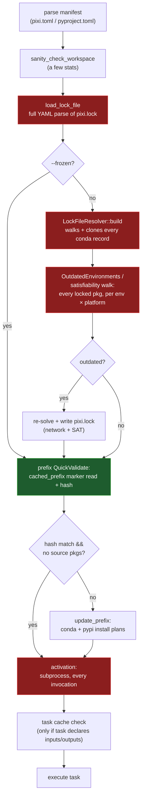
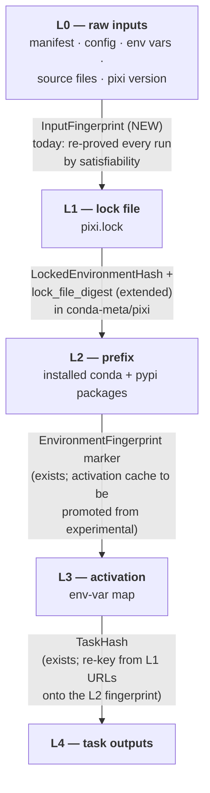
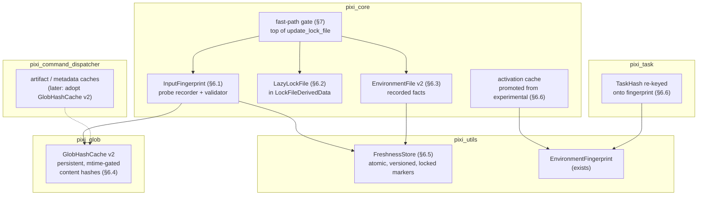
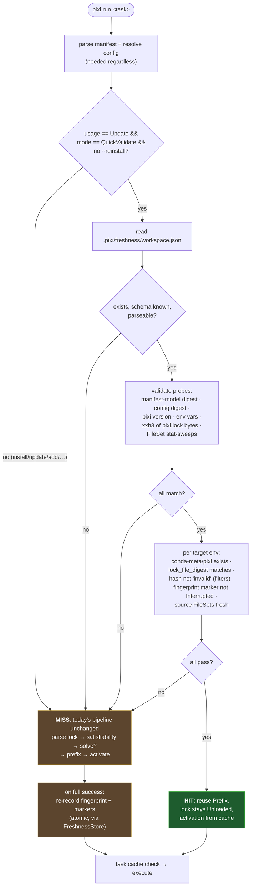
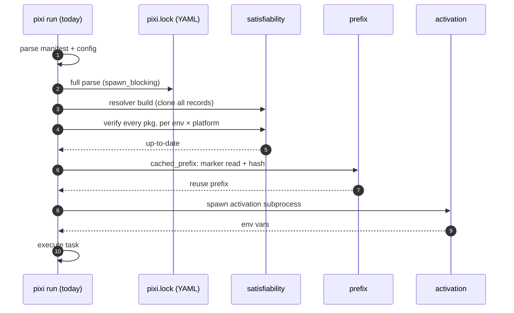
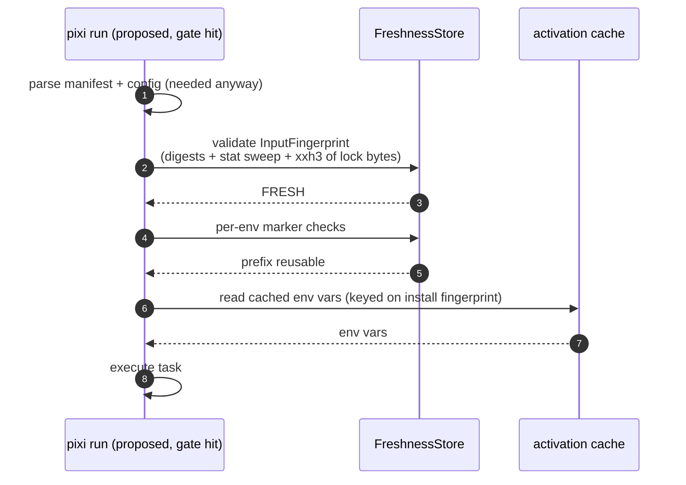
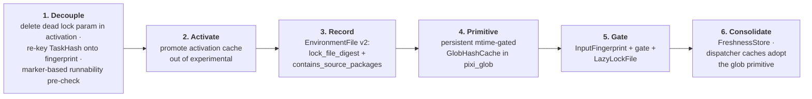

# Design: A unified freshness model and an "inputs unchanged" fast path

| | |
|---|---|
| **Status** | Draft, for discussion |
| **Scope** | `pixi run` / `pixi shell` / `pixi shell-hook` steady-state latency; unification of existing fast paths |
| **Code references** | valid as of `ca2876a` (`main`, 2026-06) |

## 1. Problem

Every pixi invocation re-establishes two facts before doing anything useful:

1. **`pixi.lock` is consistent with its inputs** — the manifest, config, and source
   package metadata (the *satisfiability* check).
2. **The installed environment is consistent with `pixi.lock`** (the *prefix* check).

Both are re-derived from scratch on every command. For large workspaces the lock
file alone can be hundreds of kilobytes to megabytes of YAML, and the checks are
linear in the number of locked packages. Running two pixi commands back-to-back
repeats all of it, even though nothing changed in between.

The goal: **if the inputs did not change since the last successful command, skip
all of these steps** — and do it with *one* coherent mechanism instead of adding
a sixth bespoke cache next to the five that already exist.

## 2. Where the time goes today

Both `pixi run` and `pixi shell` funnel through the same two primitives:
`Workspace::update_lock_file` (`crates/pixi_core/src/lock_file/update.rs:236`)
and `LockFileDerivedData::prefix` (`update.rs:771`), followed by activation.



Red nodes run **on every no-op invocation** of a typical (binary-only, default
flags) workspace. Measured by what the code does, in descending cost order:

| # | Stage | Cost on a no-op run | Anchor |
|---|-------|---------------------|--------|
| 1 | **Activation subprocess** | spawn + run activation scripts, **every run** — the cache that avoids it exists but is gated behind `experimental_activation_cache_usage` | `activation.rs:291-334` |
| 2 | **`pixi.lock` YAML parse** | O(lock size), every non-trivial run, `spawn_blocking` | `update.rs:426-442` |
| 3 | **`LockFileResolver::build`** | O(packages), **clones every conda record**; memoized only within one process | `pixi_record/src/lock_file_resolver.rs:44`, `update.rs:612` |
| 4 | **Satisfiability walk** | touches every locked package per env × platform (asserts full coverage); for *path* source deps additionally a glob re-walk + `stat()`s | `satisfiability/platform.rs:562,1175`, `outdated.rs:240` |
| 5 | Prefix quick-validate | cheap: one JSON marker read + in-memory xxh3 | `update.rs:780-893` |
| 6 | Manifest parse, sanity checks | cheap | `workspace/discovery.rs:203`, `environment/mod.rs:431` |

Stage 5 is the fast path users already benefit from — but note it sits *downstream*
of stages 2–4: it validates the prefix against a lock file that has already been
parsed and proven satisfiable.

## 3. Inventory: the fast paths we already have

There are ~14 distinct caches/early-outs. They fall into three families:

**Family A — "input fingerprint → skip work"** (persist a digest, compare, skip):

| Mechanism | Skips | Keyed on | Persisted at |
|-----------|-------|----------|--------------|
| `LockedEnvironmentHash` (`environment/mod.rs:219`) | prefix re-install in `run`/`shell` | locked pkg locations + sha256/md5 | `<env>/conda-meta/pixi` (`EnvironmentFile`) |
| `EnvironmentFingerprint` (`pixi_utils/src/environment_fingerprint.rs`) | rattler installer + conda-meta scan | installed pkg name + sha256 | `<prefix>/conda-meta/.pixi-environment-fingerprint` |
| Activation cache, `EnvironmentHash::for_activation` (`environment/mod.rs:167`) | activation subprocess | activation scripts/env + install fingerprint | `.pixi/activation-env-v0/` (**experimental**) |
| `pixi exec` env cache (`pixi_utils/src/cache.rs:8`) | solve + install of ephemeral envs | specs + channels + platform | content-addressed dir in the global cache |
| Backend-metadata cache (`pixi_command_dispatcher/src/cache/backend_metadata.rs`) | build-backend `conda/outputs` RPC | source + channels + project-model/config hashes; freshness = **file mtimes + re-glob** | `meta-v0/` |
| Artifact cache (`cache/artifact.rs`) | entire source build | structural key; freshness = **file mtimes + re-glob** | `artifacts-v0/` + sidecar |
| Task cache (`pixi_task/src/task_hash.rs`) | task re-execution | command + input/output glob hashes + env hash | `.pixi/task-cache-v0/` |

**Family B — structural re-derivation** (no stored digest; re-proved every run):
the satisfiability check itself, plus the `--frozen`/`--locked` user overrides
(`LockFileUsage`, `environment/mod.rs:585`). This family is the *target* of the
fast path, not a peer.

**Family C — per-run in-memory memoization** (orthogonal; unchanged by this
design): the compute-engine `Key` cache, `GlobHashCache`, `InstalledSourceHints`,
`LockFileDerivedData`'s per-env prefix cells.

Every Family-A entry is the same idea at a different altitude: *a digest of layer
N's identity stored next to layer N+1's output*. What's missing is the top edge —
and a shared implementation.

## 4. Why this is an architectural change, not a patch

Four verified constraints shape the design:

### 4.1 The parsed lock file is an eager, load-bearing value

`update_lock_file` parses the lock as its **first statement** (`update.rs:241`)
and returns `LockFileDerivedData`, which owns a materialized `LockFile` (public
field). Even `--frozen` pays the parse. Every existing fast path is a
*downstream consumer* of that value:

- `LockedEnvironmentHash` is computed **from the parsed lock** (`update.rs:707-719`).
- `cached_prefix`'s source-package bail-out **iterates the parsed lock** (`update.rs:861-880`).

A gate that skips the parse therefore can't just return early — it changes what
the core data type *is*. The refactor surface is modest, though: 48 uses of
`.lock_file` / `as_lock_file()` / `into_lock_file()` across 16 non-test files,
of which 24 are inside `update.rs` itself (the slow path, where the lock is
loaded by definition).

### 4.2 Five hot-path consumers read the lock — each has a marker-based way out

| Consumer | Reads from the lock | Disposition |
|----------|--------------------------------|-------------|
| Runnability pre-check (`run.rs:316-324`) | resolved virtual-package minimums | A marker-based twin **already exists**: `verify_run_platform` (`workspace/virtual_packages.rs:373`) reads `resolved_platform` / `minimum_supported_platform` from `conda-meta/pixi` — fields added precisely so this works without the lock |
| Task cache (`run.rs:378` → `executable_task.rs:401`) | `EnvironmentHash::from_environment` folds **locked URLs** (`environment/mod.rs:122-145`) | Re-key on `EnvironmentFingerprint` (a marker read). The codebase already documents URL-folding as the inferior key (`environment/mod.rs:159-166`). Only reached when a task declares `inputs`/`outputs` |
| `get_task_env` (`run.rs:438`) | passes `Option<&LockFile>` down | **Dead parameter** — bottoms out at `run_activation(_lock_file: …)`, unused (`activation.rs:286-294`). Delete |
| Prefix validation (`run.rs:411` → `prefix()`) | hash source + source-pkg bail-out | Replace on the fast path with facts recorded at install time (§6.3); the per-env hash stays on the miss path |
| `compute_post_run_hash` (`run.rs:470`) | same URL-folding hash | Same fix as the task cache |

The `verify_run_platform` precedent matters: **"record facts into the marker at
write time, answer hot-path questions from the marker"** is already this
codebase's chosen migration pattern. This design extends it rather than
inventing a new one.

### 4.3 Freshness is workspace-global

`OutdatedEnvironments::from_workspace_and_lock_file` validates **all**
environments (`update.rs:312`), so today `pixi run` keeps the *entire* lock
fresh, not just the target environment. The input fingerprint must therefore be
**workspace-scoped** to preserve semantics. (A per-environment fingerprint is
possible and faster for large multi-env workspaces, but it silently changes
behavior to "defer other envs' updates until used" — a separate decision.)

### 4.4 Two incompatible freshness strategies coexist

- **Content hashing**: `pixi_glob::GlobHash` (`glob_hash.rs:37`) reads and
  SHA-256s every matched file. Used by the legacy lock-file path. Its cache
  (`GlobHashCache`, `glob_hash_cache.rs:18`) is in-memory only and *not*
  mtime-keyed — it assumes files don't change within a process.
- **mtime + re-glob**: the dispatcher caches store per-file mtime maps and
  re-walk globs for new files, never reading contents
  (`build_backend_metadata/mod.rs:372,407`, `artifact.rs:260-310`).

mtime is cheap but unreliable across git checkouts and CI cache restores;
content hashing is authoritative but costs reads. A unified fast path must pick
a reconciliation: **mtime as pre-filter, content hash as authority** (§6.4).

## 5. The target architecture: a layered freshness model



**The unifying rule:** each edge is *a digest of layer N's identity, stored next
to layer N+1's output, validated before layer N+1's work is redone*. A command
may skip a layer's work exactly when its incoming edge validates. Three edges
exist today (built independently, each with its own storage and semantics); the
L0→L1 edge is missing entirely, which is why satisfiability is re-proved on
every invocation.

"Unify the fast paths" then has a concrete meaning: every edge uses the same
probe/validation machinery (§6.1) and the same storage discipline (§6.5),
instead of five bespoke implementations.

## 6. New abstractions



### 6.1 `InputFingerprint` — a verifying trace of L0 (the genuinely new piece)

A self-describing, serialized set of **probes**, each independently
re-checkable:

```rust
enum InputProbe {
    /// Stable-hash of the *parsed* manifest model(s).
    ManifestModel { digest: Digest },
    /// Stable-hash of the *merged, resolved* Config (covers config files
    /// AND the env vars folded into config resolution).
    ResolvedConfig { digest: Digest },
    /// xxh3 of the raw pixi.lock bytes.
    LockFileContent { digest: Digest },
    /// Raw env vars that bypass config: CONDA_OVERRIDE_*, PIXI_OVERRIDE_PLATFORM, …
    EnvVar { name: String, value_digest: Digest },
    /// Source-dependency filesets, via GlobHashCache v2 (§6.4).
    FileSet { root: PathBuf, globs: BTreeSet<String>, digest: Digest },
    PixiVersion(String),
}

struct InputFingerprint {
    schema_version: u32,
    probes: Vec<InputProbe>,
}
```

Recorded during a successful slow-path run; validated by re-evaluating each
probe at the next startup. Two design rules keep it safe *and* cheap:

1. **Digest resolved views you load anyway.** The manifest and config are
   parsed on every invocation regardless, so fingerprint the *parsed*
   `ProjectModel`/`Config` structurally — the `pixi_stable_hash` machinery
   exists for exactly this (`pixi_build_types/src/project_model.rs:700`). This
   automatically covers config-affecting env vars and sidesteps "which files
   feed config?" enumeration. Raw probes are needed only for inputs the fast
   path does *not* load: lock bytes (xxh3 over ~1 MB is trivial next to
   YAML-parsing it), source filesets, override env vars, pixi version.
2. **Unknown probe kind ⇒ miss.** Forward compatible by construction. Every
   failure mode degrades to the slow path (slow but correct), never to running
   in a stale environment — *provided* new resolution-affecting inputs always
   ship with a probe. That is a standing obligation and deserves a guardrail
   test (§9).

Persisted workspace-scoped (per §4.3), e.g. `.pixi/freshness/workspace.json`.

### 6.2 `LazyLockFile` — invert the eager parse (the biggest mechanical change)

`LockFileDerivedData.lock_file` becomes private behind a handle —
`Unloaded(path) | Loaded(LockFile)` in a `OnceCell` with an async accessor that
parses on demand (keeping today's `spawn_blocking`). The gate (§7) returns
derived data in `Unloaded` state on a hit.

- Hot-path commands (`run`/`shell`/`shell-hook`) never trigger the parse once
  §4.2's consumers are migrated.
- Content-consuming commands (`list`, `tree`, `update`, `upgrade`, `export`,
  `diff`) trigger it on first access — they still skip satisfiability on a
  gate hit, and are otherwise unchanged.
- Precedent inside the same struct: the lazily-built `LockFileResolver`
  (`update.rs:609-676`). This extends the same pattern one level up.
- The `CommandDispatcher` construction (`update.rs:285-289`) becomes lazy in
  the same stroke; a gate hit needs none of it.

### 6.3 `EnvironmentFile` v2 — record facts at write time

Extends the proven pattern (serde-defaulted fields, like
`resolved_platform`/`minimum_supported_platform` before it) in
`<env>/conda-meta/pixi` (`environment/mod.rs:321-341`):

- `lock_file_digest` — the digest of the lock **bytes** this prefix was
  installed from. The fast path compares it against the `LockFileContent`
  probe. The finer per-env `LockedEnvironmentHash` remains authoritative on
  the miss path (where the lock is parsed anyway), so per-env precision is
  unchanged where it matters.
- `contains_source_packages: bool` (plus, optionally, the source glob sets) —
  makes the source bail-out (`update.rs:861-880`) answerable **without**
  parsing the lock, and upgrades it from "always fall through" to "validate
  the recorded `FileSet` probes".

### 6.4 Persistent, mtime-gated `GlobHashCache` — the missing primitive

Resolves the §4.4 split. `pixi_glob` gains a persisted layer:

```text
(root, globs) → { files: { path → (mtime, size) }, content_digest }
```

Validation is a stat-only sweep plus a re-glob for added files; contents are
re-hashed only for entries whose (mtime, size) changed — mtime as pre-filter,
content as authority. One primitive then serves: `FileSet` probes,
satisfiability's source checks, the task cache, and (as a later migration) the
dispatcher's artifact/metadata caches.

### 6.5 `FreshnessStore` — one storage discipline instead of five

`MetadataCache` (`pixi_command_dispatcher/src/cache/common.rs:22`) already
solved atomic JSON markers with fd-locking and optimistic version counters.
Generalize it (natural home: `pixi_utils`, next to `EnvironmentLock`) and move
the workspace fingerprint, `EnvironmentFile`, and the activation cache onto it.
This is what makes "unified" real: one read/write/versioning/corruption-handling
implementation, uniform markers, and a debugging story (`pixi info` can print
per-layer freshness state and *why* a layer missed).

### 6.6 Re-key L3/L4 onto L2; promote the activation cache

`TaskHash` and the activation cache both key on the `EnvironmentFingerprint`
marker — one small file read, no lock parse. Flipping the activation cache out
of `experimental` (`activation.rs:307`) is the **single highest-leverage change
in this document**: the subprocess it eliminates dominates steady-state no-op
latency, and its key is already correct (it folds the install fingerprint, so
source rebuilds invalidate it properly).

## 7. Fast-path control flow

The gate lives at the **top of `Workspace::update_lock_file`
(`update.rs:236`), before `load_lock_file()`** — the one chokepoint both
commands funnel through.



Before/after, as sequences:





Net effect of a no-op `pixi run`: one manifest parse + one config load + a stat
sweep + one hash over the lock bytes + three small marker reads. No YAML lock
parse, no resolver clone, no satisfiability walk, no activation subprocess.

## 8. On-disk state

```text
<workspace>/
├── pixi.toml                         # L0 input
├── pixi.lock                         # L1; fast path hashes bytes, never parses
└── .pixi/
    ├── freshness/
    │   └── workspace.json            # NEW: InputFingerprint (L0→L1 edge), workspace-scoped
    ├── envs/<name>/conda-meta/
    │   ├── pixi                      # EnvironmentFile: LockedEnvironmentHash,
    │   │                             #   resolved/minimum platform,
    │   │                             #   NEW: lock_file_digest, contains_source_packages
    │   ├── .pixi-environment-fingerprint   # install fingerprint + Fresh/Interrupted/Installed
    │   ├── prefix                    # relocation guard
    │   └── *.json                    # rattler PrefixRecords (slow path only)
    ├── activation-env-v0/            # L2→L3 cache (promoted from experimental)
    ├── task-cache-v0/                # L3→L4 cache (re-keyed onto fingerprint)
    └── glob-hash-v0/                 # NEW: persistent mtime-gated glob hashes (§6.4)
```

(The dispatcher's `meta-v0/`, `artifacts-v0/`, `bld/` caches are unchanged by
this design; they optionally adopt the glob-cache primitive later.)

## 9. Correctness and invalidation rules

1. **Write discipline.** The fingerprint is written only after *everything*
   succeeded: satisfiability passed or the solve completed, the lock was
   written, prefixes installed, env files written. Partial/failed runs never
   record. Writes are atomic (temp + rename) via `FreshnessStore`.
2. **No transitive trust.** Tasks mutate the filesystem (the in-process caches
   are already cleared for this reason, `run.rs:433`). Probes are therefore
   *always re-validated at startup*; "the last command succeeded" is never a
   substitute for probing.
3. **Fail toward slowness.** Any unparseable, version-skewed, conflicted, or
   unknown-probe marker is a miss, not an error. The slow path is the always-
   correct fallback and re-records on success.
4. **Probe completeness is a standing obligation.** A fingerprint is a cache
   where satisfiability was a proof. Every new resolution-affecting input (env
   var, config key, manifest field) must ship with a probe. Add a guardrail
   test that cross-checks the satisfiability inputs (§5 of the satisfiability
   docs / `EnvironmentUnsat` variants) against probe coverage, so forgetting
   one fails CI rather than shipping staleness.
5. **Deliberate bypasses.** `Revalidate` callers (`pixi install`, `add`,
   `remove`, `update`, `upgrade`, `reinstall`), non-`Update` lock-file usage,
   `--reinstall`, and active `InstallFilter`s (which already write an
   `invalid` hash, `update.rs:794-798`) skip the gate by design.
6. **Concurrency.** Reuse the existing patterns: fd-locks (`EnvironmentLock`)
   and optimistic version counters (`MetadataCache::try_write`). Concurrent
   writers conflict-detect; readers treat conflicts as a miss.

## 10. Migration plan

Each phase ships independently and is useful on its own:



- **Phase 1** is pure cleanup that shrinks the problem: after it, `pixi run`'s
  hot path touches the parsed lock only inside `prefix()`.
- **Phase 2** is the biggest single latency win and is independent of
  everything else (it needs its own invalidation review — which is itself a
  motivation for the unified model).
- **Phases 3–4** are mechanical and backward compatible (serde defaults; a new
  cache directory).
- **Phase 5** is the core feature. Start conservative: `Update` usage +
  `QuickValidate` mode only; miss on any doubt; workspaces with path source
  deps validate their `FileSet` probes rather than being excluded.
- **Phase 6** is where "a number of fast paths" becomes "one freshness model".

## 11. Risks and open questions

| Topic | Risk / question | Position |
|---|---|---|
| Probe under-enumeration | Missing probe ⇒ silent staleness | Guardrail test (§9.4); digest resolved views instead of raw files where possible; unknown-probe ⇒ miss |
| Workspace- vs env-scoped fingerprint | Per-env is faster for big multi-env workspaces but changes "any command keeps the whole lock fresh" semantics | **Workspace-scoped** first (preserves semantics); revisit per-env as an explicit opt-in later |
| `--frozen` through the gate | `--frozen` still parses the lock today; a gate hit could skip that too | Out of scope for v1; trivial follow-up once LazyLockFile exists |
| Replacing `LockedEnvironmentHash` with the file digest | The file digest is coarser (any lock change invalidates every env's gate) | Keep **both**: digest gates the fast path; per-env hash keeps its precision on the miss path. No behavior change |
| pypi has no inner fingerprint | On any miss with pypi packages, site-packages is still fully scanned (`pixi_install_pypi/src/plan/planner.rs:114`) | Unchanged by this design (gate hits avoid it entirely); a pypi analogue of `EnvironmentFingerprint` is a natural follow-up |
| mtime reliability | git checkout / CI restores scramble mtimes | mtime is only ever a pre-filter; content hashes decide (§6.4) |
| Marker corruption / version skew | stale or foreign markers | `schema_version` + `PixiVersion` probe; any anomaly ⇒ miss |

## Appendix A: code index

| What | Where |
|---|---|
| Lock update orchestration, gate site, `LockFileDerivedData`, `UpdateMode`, `cached_prefix` | `crates/pixi_core/src/lock_file/update.rs:236,241,305,319,426,563,615,707,771,845` |
| Outdated + satisfiability | `crates/pixi_core/src/lock_file/outdated.rs:128,240`; `satisfiability/environment.rs:31`; `satisfiability/platform.rs:150,562,1175`; `satisfiability/source_record.rs:107` |
| Resolver clone-walk | `crates/pixi_record/src/lock_file_resolver.rs:44` |
| `EnvironmentHash` (both flavours), `LockedEnvironmentHash`, `EnvironmentFile`, `LockFileUsage` | `crates/pixi_core/src/environment/mod.rs:107,122,167,219,321,585` |
| Prefix install fingerprint + lock | `crates/pixi_utils/src/environment_fingerprint.rs`; `environment_lock.rs`; fast path use at `pixi_command_dispatcher/src/install_pixi/ext.rs:225-263` |
| Activation (experimental gate, dead param) | `crates/pixi_core/src/activation.rs:286-316` |
| Runnability, marker-based twin | `crates/pixi_core/src/workspace/virtual_packages.rs:109,373,455` |
| Task cache | `crates/pixi_task/src/executable_task.rs:401`; `task_hash.rs:76-98` |
| Glob primitives | `crates/pixi_glob/src/glob_hash.rs:37`; `glob_hash_cache.rs:18,52`; `glob_mtime.rs:33` |
| Dispatcher cache framework | `crates/pixi_command_dispatcher/src/cache/common.rs:22,119,318`; `backend_metadata.rs:65`; `artifact.rs:79,260` |
| Backend-metadata freshness (mtime + re-glob) | `crates/pixi_command_dispatcher/src/build_backend_metadata/mod.rs:295,359,372,407` |
| `pixi run` lock consumers | `crates/pixi_cli/src/run.rs:316,324,378,411,438,470` |
| Stable hashing | `crates/pixi_stable_hash/src/lib.rs`; `pixi_build_types/src/project_model.rs:700`; `pixi_command_dispatcher/src/input_hash.rs:11,65` |
